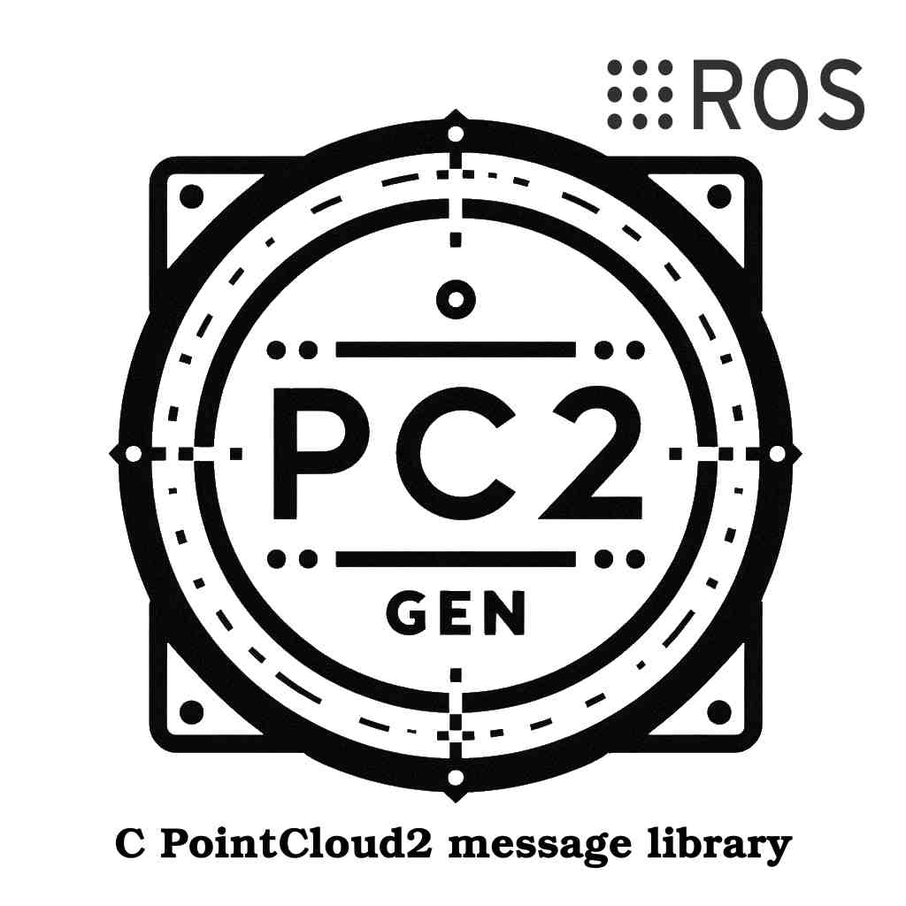

<p align="center">

</p>

# Description

**Pc2Gen API aims to lower time and code complexity of [sensor_msgs/PointCloud2](https://docs.ros.org/en/ros2_packages/rolling/api/sensor_msgs/interfaces/msg/PointCloud2.html) integration** within [ROS2](https://docs.ros.org/en/rolling/index.html) or [micro-ros](https://micro.ros.org) project. It also features [sensor_msgs/PointCloud2](https://docs.ros.org/en/ros2_packages/rolling/api/sensor_msgs/interfaces/msg/PointCloud2.html) manipulation functions.

# Library usage

**1. Instanciation**

To instanciate your PointCloud2 message, call the function `CreatePointCloud2FromDevice` as follow :

```C
  /* PointCloud2 declaration */
  sensor_msgs__msg__PointCloud2 cloud;

  /* Mock (sensor characteristics) */
  uint32_t height_size = 8;     // Nbr column pixels
  uint32_t width_size = 8;      // Nbr line pixels
  bool is_bigendian = false;    // Data bytes ordering
  
  /* PointCloud2 instanciation */
  bool success = CreatePointCloud2FromDevice(&cloud, "xyz_device", height_size, width_size, is_bigendian);
```
On success return, function `CreatePointCloud2FromDevice` allocates needed memory space and populates fields regarding "xyz_device" field structure definition.

**2. Data feeding**

Feed the message with your sensor data :

```C
//  cloud.data.data is typed pointer as described
//  in the 'pointField_def.yaml' file
(float) * my_xyz_sensor_data;

/*
*   Fetch X-Y-Z data from your sensor ...
*/

//  Link data cloud pointer to your fetched data
cloud.data.data = my_xyz_sensor_data;
```

## Compile library

From your ROS workspace, run the following shell command :
```bash
colcon build --packages-select c_pc2_iterator
```
# Test library

From your ROS workspace, run the following shell command :

```bash
colcon test --packages-select c_pc2_iterator --event-handlers console_direct+
```

# Issue

If you find issue(s), please report to the [dedicated tumb](https://github.com/fofolevrai/pc2Gen_API/issues)
# Contribute

Contributions are what make the open source community such an amazing place to learn, inspire, and create. Any contributions you make are **greatly appreciated**.

If you have a suggestion that would make this better, please fork the repo and create a pull request. You can also simply open an issue with the tag "enhancement".
Don't forget to give the project a star! Thanks again!

1. Fork the Project
2. Create your Feature Branch (`git checkout -b feature/AmazingFeature`)
3. Commit your Changes (`git commit -m 'Add some AmazingFeature'`)
4. Push to the Branch (`git push origin feature/AmazingFeature`)
5. Open a Pull Request

## Authors

* [@fofolevrai](https://github.com/fofolevrai)


## License

This project is provided under the [BSD-3](https://opensource.org/license/bsd-3-clause) License - see the [LICENCE.md](LICENCE.md) file for details